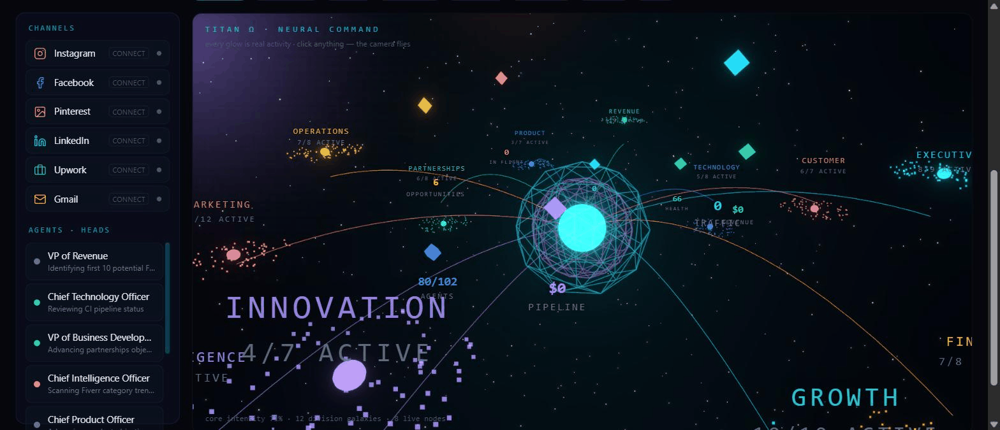
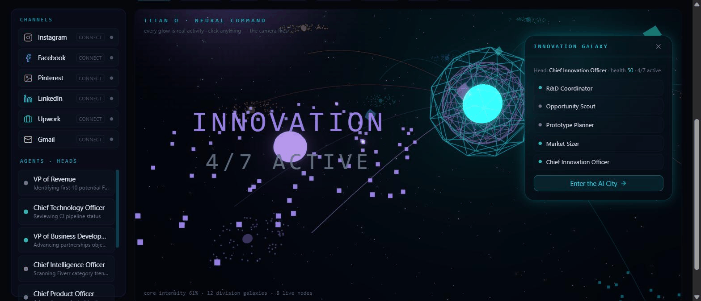

<div align="center">

# TITAN Ω — the Autonomous AI Business Operating System

**Not a dashboard. A living AI command universe that runs a founder's business 24/7 — built solo, with $0.**

[🚀 Live demo](https://careermind2026-project-titan-omega.hf.space) · Built by [Abdullah Rathore](https://github.com/AbdullahRathoreVA)


</div>

---

## What you're looking at

Every glow in that universe is **real activity** — nothing is decorative. The core pulses with live agent
work streamed over Server-Sent Events. The 12 galaxies are real departments with real AI agents. Comets
fire when real events happen. Revenue starts at $0 and only ever shows the truth.

| | |
|---|---|
|  |  |
| The Neural Command Universe — 12 division galaxies orbit the Titan Core | Click a galaxy → the camera flies there and a hologram window opens with its live agents |

## The whole operating system

- 🌌 **Neural Command Universe** — cinematic 3D home: breathing camera, division galaxies, floating live-metric holograms, activity comets
- 🎬 **Cinematic boot** — particles assemble `HELLO ABDULLAH` from light, an AI voice announces systems status, the camera flies through into the universe
- 🏙 **AI City** — departments as neon districts; fly between them, inspect and **talk to any of 102 agents** (in character, with live task context)
- ⚔️ **War Room** — three AI marketers pitch → a **CFO and Risk Officer challenge them** → the head decides with a confidence score. Every decision audited
- 🏭 **Content Factory** — one idea → blog + LinkedIn + X thread + Instagram caption + email + Shorts script, in one click
- 🌍 **Universal voice** — Ask Titan answers *and speaks* in 12 languages (English, اردو, हिन्दी, العربية, Español, Français, Deutsch, 中文, 日本語, Türkçe, Português, Русский) with a voice-reactive **holographic founder**
- 📡 **Autonomous growth engine** — live web research every 4h: earning opportunities, competitor moves, SEO keywords
- 💼 **Job Radar** — hunts real remote gigs, fit-scores them 0–100, drafts truthful proposals
- 💰 **Finance + CRM** — real revenue/expense ledgers, honest run-rate forecast, leads pipeline, automation-ROI panel
- 📱 **Telegram command center** — `/status`, `/revenue`, `/approveplan`… run the empire from a phone
- 🤖 **Auto-PRs** — agents open real GitHub pull requests (review-gated, never auto-merged)
- 🏆 **Founder XP** — levels and milestones computed **only from real events**

## Engineering highlights

- **Self-healing AI layer** — Groq → Gemini → OpenRouter failover with **live model-catalog discovery** on all three, so provider model retirements can't silence the system. Every credential whitespace-hardened. One diagnostic URL (`/api/doctor`) exposes exactly what the running container sees
- **Real-time everywhere** — FastAPI SSE stream drives counters, feeds, and every 3D intensity
- **One container** — Next.js static export served by FastAPI; GitHub Actions → Hugging Face Spaces auto-deploy
- **Graceful everywhere** — every 3D scene has an error boundary + mobile fallback; every engine degrades honestly when a key is missing
- **32 backend tests**, verified deploys, zero paid services

## Stack

`Python` `FastAPI` `Next.js 14` `TypeScript` `Tailwind` `three.js / react-three-fiber` `@react-three/postprocessing`
`framer-motion` `WebAudio (synthesized sound)` `Web Speech API` `SSE` `Telegram Bot API` `Tavily` `Make.com` `Docker` `HF Spaces`

## Run it yourself

```bash
# backend
cd backend && pip install -r requirements.txt && uvicorn app.main:app --port 8000
# frontend (dev, separate terminal)
cd frontend && npm install && npm run dev
```

Deploy: push to `main` → GitHub Actions syncs to a Hugging Face Space (Docker). See `DEPLOY.md`,
`MAKE_SETUP.md` (automations) and `TELEGRAM_SETUP.md` (phone control).

## Honesty as a design principle

Titan never fakes numbers. Revenue is $0 until a real order is logged. Forecasts are labelled run-rates.
XP moves only on real events. Missing integrations say "connect" instead of showing invented data.
That constraint shaped every feature in this repo.

---

<div align="center">

**Built with zero budget by a solo founder in Pakistan — with AI pair-programming.**
*If this repo impresses you, the founder is available for AI product work.*

</div>
